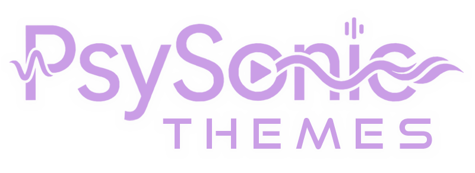

<p align="center">
  
</p>

The community theme catalogue for **[Psysonic](https://github.com/Psychotoxical/psysonic)**, the cross-platform music player.

Psysonic ships with six core themes built in; every other palette lives here and
installs **on demand** from the in-app **Theme Store** — 80-plus and counting.
They range from faithful recolours of beloved open-source palettes (Catppuccin,
Gruvbox, Nord, Dracula, Kanagawa, Nightfox, Atom One, …) to themes inspired by
apps, films, games, and classic operating systems.

A theme is just a small, safe set of colour tokens — no scripts, no external
resources. That is what lets the store install them with one click, and lets us
merge community submissions after a quick visual check.

## Using themes

In Psysonic, open **Settings → Themes → Theme Store**, then search, preview, and
hit **Install**. Installed themes apply instantly and keep working offline. You
don't need to clone this repo — it's just the source the app reads from.

## How it works

The app reads one auto-generated index, [`registry.json`](registry.json), over
the [jsDelivr](https://www.jsdelivr.com/) CDN, and pulls each theme's CSS and
thumbnail on demand. Nothing here is bundled into the app.

## Anatomy of a theme

```
themes/<id>/
├── manifest.json   # id, name, author, version, description, mode, [tags], [minAppVersion]
├── theme.css       # a single [data-theme='<id>'] block of contract tokens
└── thumbnail.png   # store preview (recommended 720×450)
```

`theme.css` may set **only** the colour tokens listed in
[`schema/allowed-tokens.json`](schema/allowed-tokens.json) (plus `color-scheme`),
on exactly one `[data-theme='<id>']` selector — no other selectors, no `@import`,
no external `url()`. The validator enforces this, which is what keeps every
submission safe to merge.

## Make a theme

1. Copy [`template/`](template/) to `themes/<your-id>/`.
2. Rename the `[data-theme='template']` selector and `manifest.id` to your id
   (lowercase kebab-case, must match the folder name).
3. Recolour the tokens — set every core token; trim the optional block if unused.
4. Add a `thumbnail.png`: a screenshot of Psysonic with your theme applied (PNG,
   ≤ 300 KB, recommended 720×450). Quick placeholder:
   `node scripts/make-thumbnail.mjs themes/<your-id>/thumbnail.png "#15171e"`.
5. Validate, then open a pull request.

```
npm install
node scripts/validate-theme.mjs themes/<your-id>   # one theme
node scripts/validate-theme.mjs                    # every theme
```

See **[CONTRIBUTING.md](CONTRIBUTING.md)** for the full guide — naming,
description conventions, and the PR checklist.

## Registry

[`registry.json`](registry.json) is the single index the app reads. It is
**auto-generated** from the theme manifests — never edit it by hand. A workflow
regenerates it on every push to `main`; locally, run `npm run registry`.

## License

Themes are contributed and distributed under the [MIT License](LICENSE).
